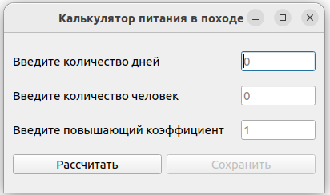

# HikeMenuCalculator - Калькулятор походного меню

Программа для автоматической генерации рациона питания для походов.

## Возможности

- Расчет рациона на заданное количество дней
- Учет количества человек
- Автоматический подбор блюд из базы данных
- Экспорт в PDF и DOC форматы
- Поддержка русских названий продуктов

## Требования

- Qt6
- SQLite3
- LaTeX (для генерации PDF)

## Установка

```bash
git clone https://github.com/ВАШ_АККАУНТ/HikeMenuCalculator.git
cd HikeMenuCalculator
qmake
make
./HikeMenuCalculatorGUI

## Структура проекта

- расчеты/ - основная логика программы
- database/ - база данных продуктов и блюд
- *.pro - файл проекта Qt

## Использование

- Введите количество дней
- Введите количество человек
- Укажите повышающий коэффициент (если нужен)
- Нажмите "Рассчитать"
- Сохраните результат в PDF или DOC

## Скриншоты



## Контакты

Email: tavaeva_a_f@bk.ru
